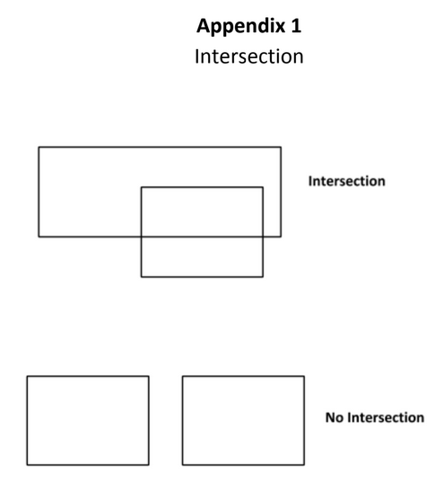
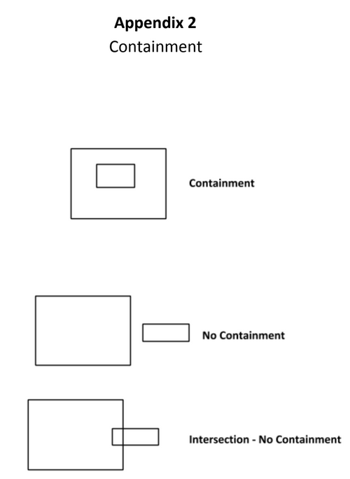
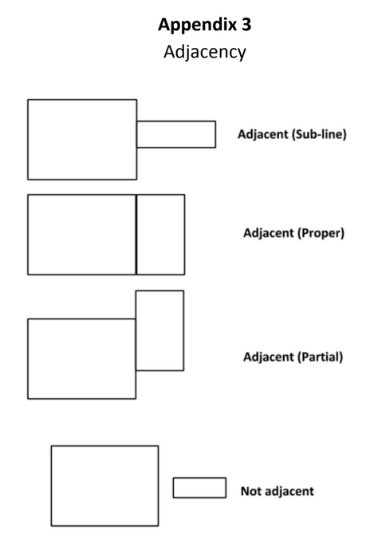

# Rectangles

Contains the logic for analyzing two rectangles based on the algorithm below.
## How to use

1. git clone
2. `npm i`
3. `npm run start`

## How to run with test data
1. open `data/data.csv`
2. add two rectangles data (`x`,`y`,`width`,`height`,`x`,`y`,`width`,`height`). No `spaces` and Use `integers`!
3. `npm run start`

You should see output as
```
=====
Rectangle 1: origin:{"x":10,"y":10} , width: 10, height: 10, corners: [{"x":10,"y":10},{"x":10,"y":20},{"x":20,"y":20},{"x":20,"y":10}]
Rectangle 2: origin:{"x":20,"y":0} , width: 10, height: 10, corners: [{"x":10,"y":10},{"x":10,"y":20},{"x":20,"y":20},{"x":20,"y":10}]
Rectangles have no containment
Rectangles have adjacency of type: partial
=====
Processed 1 rows
```

## Code
1. Rectangle.ts - code for comparing two Rectangles
2. index.ts - simple runner that reads test data from csv and outputs to console.log
3. unit tests `npm run test`

## Acknowledgement
1. Thanks to authors of  line-intersect (https://www.npmjs.com/package/line-intersect) and (https://c2fo.github.io/fast-csv/) for their awesome libraries.
   


## Algorithm Requirements

1. **Intersection**: You must be able to determine whether two rectangles have one or more
intersecting lines and produce a result identifying the points of intersection. 



2. **Containment**: You must be able to determine whether a rectangle is wholly contained within
another rectangle. 



3. **Adjacency**: Implement the ability to detect whether two rectangles are *adjacent*. Adjacency is
defined as the sharing of at least one side. Side sharing may be *proper*, *sub-line* or *partial*. A
sub-line share is a share where one side of rectangle A is a line that exists as a set of points
wholly contained on some other side of rectangle B, where partial is one where some line
segment on a side of rectangle A exists as a set of points on some side of Rectangle B.


